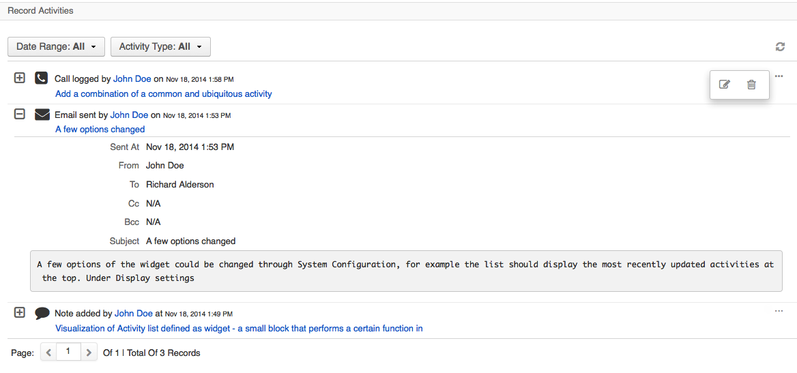

OroActivityListBundle
=====================
The `OroActivityListBundle` provide ability to show all activities in one widget.

Table of content
----------------
- [Fundamentals](#fundamentals)
- [Add widget into a page](#add-widget-into-a-page)
- [Register a new entity](#register-a-new-entity)
- [Configuration](#configuration)

Fundamentals
------------

Examples of activities that can be added to other entities are:
- Emails
- Calendar events
- Notes

Visualization of Activity list defined as widget block. It shows activities related to the entity record, currently being viewed, in a single list with ability to filter by activity type (multiselect) and date (daterange filter).

Each activity row shows base information about itself: type of activity, who and when have created and update it, also you have access to the full activity record via "expand" action. By default is displayed 25 records, sorted by update date in descending order. The limitation and sorting can be changed in [UI](#configuration) .

The widget currently displayed in "Record activities" placeholder block on an entities view page.

**Example UI within contact page**


Add widget into a page
----------------------
Generally widget will be rendered in placeholder "view_content_data_activities". But in case of extending or using view template different from 'OroUIBundle:actions:view.html.twig' you will have to define placeholder in it, e.g.: 

```
  
    
  
  
```

Register a new entity
----------------------
To add a new entity to be displayed within widget you need to register a service that implements **ActivityListProviderInterface** and tagged as **oro_activity_list.provider**. Working example can be found in EmailBundle or CalendarBundle:
```
    oro_calendar.activity_list.provider:
        class: %oro_calendar.activity_list.provider.class%
        arguments:
           - @oro_entity.doctrine_helper
           - @doctrine
        tags:
           - {name: oro_activity_list.provider, priority: 50}
```
This will add your provider class into a bunch of providers (**ActivityListChainProvider**) that will be invoked to fetch data ordering by priority (added in service definition). For now 'priority' do not have much sense, but it may be useful in future implementations or in case of overriding some existing providers in 3rd party bundles.

Each activity entity has its own row template for UI component. Generally you are free to place it anywhere you want, only requirement is: it's path should be returned in Provider via method getTemplate(). E.g.
```
class CalendarEventActivityListProvider implements ActivityListProviderInterface
{
...
/**
* {@inheritdoc}
*/
public function getTemplate()
{
   return 'OroCalendarBundle:CalendarEvent:js/activityItemTemplate.js.twig';
}
...

```

Configuration
-------------
Sorting and limitation could be changed in UI: System -> Configuration -> Display settings -> section "Activity lists".

 - Sort by field - sorting available by "Created date" or "Updated date"(default).
 - Sort direction - Ascending or Descending(default).
 - Items Per Page By Default - number of activities displayed in list. Default is 25. 
